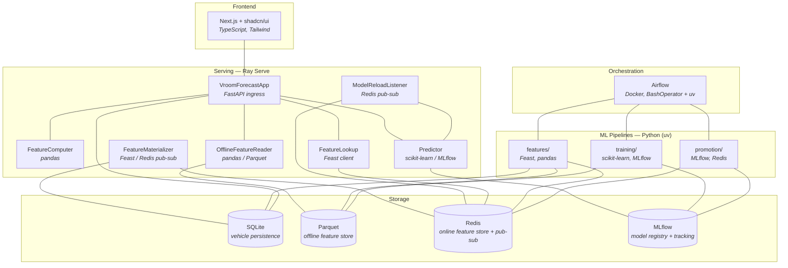
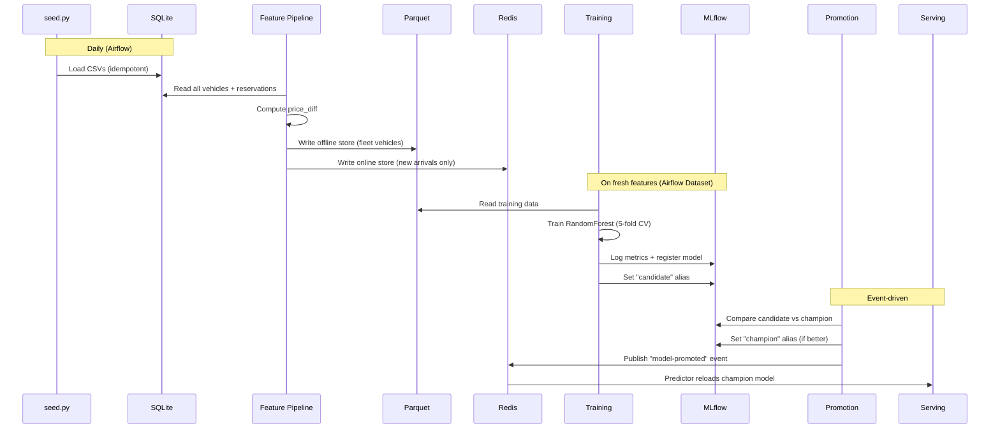

# Vroom Forecast

[](https://github.com/pierreWagou/vroom-forecast/actions/workflows/ci.yml)
[](https://github.com/pierreWagou/vroom-forecast/actions/workflows/cd-docs.yml)
[](LICENSE)
[](https://github.com/astral-sh/ruff)
[](https://github.com/pre-commit/pre-commit)


ML pipeline that predicts the number of reservations a vehicle will receive
based on its listing attributes. Built as a take-home project for a
**Staff MLOps Engineer** position at Turo.

## Getting Started

### Prerequisites

- [mise](https://mise.jdx.dev/getting-started.html) — installs and manages all dev tools automatically
- [Docker Desktop](https://docs.docker.com/get-docker/) — runs MLflow, Redis, Airflow, and Ray Serve

### Setup

```bash
git clone https://github.com/pierreWagou/vroom-forecast.git
cd vroom-forecast

# 1. Install tools (Python 3.12, Node LTS, uv, mprocs)
mise install

# 2. Bootstrap all dependencies
mise run setup

# 3. Start everything
mise run dev
```

The UI is at [localhost:3000](http://localhost:3000). Trigger the ML pipeline
from Airflow at [localhost:8080](http://localhost:8080) (credentials: `admin` / `admin`).

### Quick Test

Once services are running and the pipeline has completed (`mise run pipeline` or
trigger from Airflow):

```bash
curl -s -X POST http://localhost:8000/predict \
  -H "Content-Type: application/json" \
  -d '{"technology":1,"actual_price":45,"recommended_price":50,"num_images":8,"street_parked":0,"description":250}'
```

```json
{"predicted_reservations": 4.12, "model_version": "1"}
```

Interactive docs at [localhost:8000/docs](http://localhost:8000/docs).
A [Bruno](https://www.usebruno.com/) API collection is included in `bruno/` — open it to hit every endpoint with pre-filled sample payloads.

## Architecture



> **Zoom in:** [Feature Store](features/) · [Serving](serving/) · [Training](training/) · [Promotion](promotion/) · [Orchestration](airflow/) · [Frontend](ui/) · [Exploration](exploration/)

## Available Tasks

| Command | Description |
|---|---|
| `mise run setup` | Bootstrap all sub-project deps + pre-commit hooks |
| `mise run dev` | Start all services (mprocs: Docker, UI, Jupyter, Docs) |
| `mise run check` | Full CI check: lint + type check + tests (pre-commit) |
| `mise run seed` | Seed DB + materialize features (local, no Airflow) |
| `mise run train` | Train a model locally |
| `mise run promote` | Run champion/challenger promotion locally |
| `mise run pipeline` | Full ML pipeline: seed → train → promote |

## Services

| Service | Port | Description |
|---------|------|-------------|
| MLflow | [localhost:5001](http://localhost:5001) | Experiment tracking + model registry |
| Redis | localhost:6379 | Online feature store + pub/sub |
| Redis Insight | [localhost:5540](http://localhost:5540) | Redis GUI |
| Airflow | [localhost:8080](http://localhost:8080) | Pipeline orchestration |
| Ray Serve API | [localhost:8000](http://localhost:8000) | Prediction API (Ray Serve) |
| API Docs | [localhost:8000/docs](http://localhost:8000/docs) | Interactive Swagger UI |
| Ray Dashboard | [localhost:8265](http://localhost:8265) | Ray cluster monitoring |
| UI | [localhost:3000](http://localhost:3000) | Next.js frontend |
| Docs | [localhost:8100](http://localhost:8100) | MkDocs documentation |
| Jupyter | localhost:8888 | EDA notebooks |

## Project Structure

```
training/          ML training pipeline (pandas, sklearn, mlflow)
promotion/         Champion/challenger model promotion (mlflow, redis)
serving/           Ray Serve prediction API (ray, fastapi, feast)
features/          Feast feature store + materialization pipeline
exploration/       EDA notebook (jupytext)
ui/                Next.js + shadcn/ui frontend
airflow/           Airflow DAGs + Dockerfile
data/              Raw CSV datasets (vehicles + reservations)
```

Each sub-project is fully independent with its own `pyproject.toml`, `uv.lock`,
and `.venv`. See each sub-project's README for details.

## ML Pipeline



> **Deep dive:** [Feature pipeline](features/) · [Training](training/) · [Promotion](promotion/) · [Airflow DAGs](airflow/) · [Serving](serving/)

## Dev Tools

```bash
# Setup (one-time)
uvx pre-commit install

# Run all checks
uvx pre-commit run --all-files
```

| Tool | Scope | Purpose |
|------|-------|---------|
| Ruff | Python | Formatting + linting |
| ty | Python (per sub-project) | Type checking |
| ESLint | TypeScript | Linting |
| tsc | TypeScript | Type checking |
| pytest | Python (per sub-project) | Tests |

## Tech Stack

| Technology | Role |
|------------|------|
| Python 3.12 | Primary language |
| Ray Serve | Model serving (autoscaling, deployment composition) |
| FastAPI | HTTP API (Ray Serve ingress) |
| MLflow | Experiment tracking, model registry |
| Feast | Feature store (offline: Parquet, online: Redis) |
| Airflow | Pipeline orchestration |
| Redis | Online feature store + pub/sub events |
| Docker Compose | Local infrastructure |
| Next.js | Frontend (React, TypeScript, Tailwind) |
| shadcn/ui | UI component library |
| uv | Python package management |
| Ruff + ty | Linting + type checking |

## Key Findings — What Drives Reservations?

**Dataset:** 1,000 vehicles, 6,376 reservations. 9% of vehicles have zero reservations.
Average reservations per vehicle: 6.4 (median 5, std 4.9).

### Top Factors (RandomForest feature importance)

| Rank | Feature | Importance | Correlation | Interpretation |
|------|---------|------------|-------------|----------------|
| 1 | **price_diff** | 26.2% | -0.367 | The gap between actual and recommended price is the strongest predictor. Vehicles priced **below** the recommended price get significantly more reservations. |
| 2 | **price_ratio** | 20.7% | -0.398 | Confirms the pricing story. A ratio below 1.0 (underpriced) drives bookings. The strongest linear correlation of any feature. |
| 3 | **description** | 16.9% | +0.016 | Description length matters to the model but has near-zero linear correlation — the relationship is non-linear. Very short and very long descriptions both underperform. |
| 4 | **actual_price** | 11.9% | -0.259 | Lower absolute price drives more reservations, independent of the recommended price. |
| 5 | **num_images** | 10.5% | +0.220 | More photos → more reservations. The second strongest linear correlation. |
| 6 | **recommended_price** | 10.1% | -0.013 | Market price alone doesn't predict reservations, but it matters in combination with actual price (via the derived features). |
| 7 | **street_parked** | 2.1% | -0.017 | Minimal impact. Convenience of parking is not a major factor. |
| 8 | **technology** | 1.5% | +0.136 | Having a tech package helps slightly, but it's the weakest predictor. |

### Key Insights

1. **Pricing relative to market is everything.** The two derived features (`price_diff`, `price_ratio`) together account for 47% of the model's predictive power. Hosts who price below the recommended price see dramatically more bookings.

2. **Listing quality matters.** Description length (17%) and number of photos (10.5%) together account for 27%. This is actionable — Turo could nudge hosts to write longer descriptions and upload more photos.

3. **Absolute price is secondary to relative price.** `actual_price` alone is 12%, but the ratio/diff with `recommended_price` is 47%. A $100/day car priced at its recommended price gets more bookings than a $50/day car priced above its recommendation.

4. **Parking and technology are noise.** Together they account for only 3.6% of importance. These are "nice to have" but don't drive booking decisions.

### Model Performance

| Metric | Value |
|--------|-------|
| CV MAE (5-fold) | 3.45 (+/- 0.13) |
| Model | RandomForestRegressor (200 trees, max_depth=10) |

The model predicts reservation counts with an average error of ~3.5 reservations.
This is reasonable given the target distribution (mean 6.4, std 4.9).

## Latency Benchmark Report

Benchmarked over 1,000 iterations on the containerized Ray Serve deployment
(Docker, Apple M-series, single replica).

### Raw Features Path (`POST /predict`)

Features computed on the fly from request attributes → model inference.

| Metric | Value |
|--------|-------|
| **Average** | 18.94 ms |
| **p50 (median)** | 18.04 ms |
| **p95** | 29.07 ms |
| **p99** | 31.63 ms |

Step breakdown:
- Feature computation (FeatureComputer deployment): **2.65 ms** avg
- Model inference (Predictor deployment): **16.29 ms** avg

### Online Store Path (`POST /predict/id`)

Pre-computed features looked up from Redis → model inference.

| Metric | Value |
|--------|-------|
| **Average** | 18.13 ms |
| **p50 (median)** | 17.83 ms |
| **p95** | 18.83 ms |
| **p99** | 29.33 ms |

Step breakdown:
- Feature lookup from Redis (FeatureLookup deployment): **2.57 ms** avg
- Model inference (Predictor deployment): **15.56 ms** avg

### Analysis

Both paths have similar total latency (~18ms) because:

1. **Model inference dominates** at ~16ms — a RandomForest with 200 trees
   traverses all trees on every prediction.
2. **Feature computation is trivial** (~2.6ms) — two arithmetic operations
   (price_diff, price_ratio) take the same time as a Redis network round-trip.
3. **Ray Serve inter-deployment communication** adds ~2-3ms per hop
   (serialization through Ray's object store).

The online store path shows **tighter p95/p99 latency** (18.8ms vs 29.1ms),
meaning more consistent response times — fewer outlier predictions.

### What Would Change at Scale

| Optimization | Impact |
|--------------|--------|
| ONNX export of the RandomForest | 5-10x faster inference (eliminate Python overhead) |
| Batch requests to the Predictor | Amortize Ray serialization across N predictions |
| Multiple Predictor replicas | Linear throughput scaling |
| GPU-based model (XGBoost, neural net) | Leverage Ray Serve's GPU-aware scheduling |
| More complex features (aggregations, embeddings) | Online store path becomes significantly faster than on-the-fly |

## Design Decisions

- **RandomForest over XGBoost/LightGBM** — The dataset is small (~500 vehicles) and the feature set simple. RF achieves CV MAE 3.44 with zero tuning; gradient boosting adds complexity and overfitting risk for marginal gain. Easy to swap later — the pipeline is model-agnostic.

- **Ray Serve over plain FastAPI/Gunicorn** — Turo lists Ray as a high-priority technology. Ray Serve's deployment composition lets us scale the Predictor, FeatureLookup, and FeatureMaterializer independently. For a single-model demo this is over-engineered — but it demonstrates the pattern Turo would use at scale.

- **Feast over a raw Redis client** — Feast gives us a unified offline/online store abstraction with point-in-time correctness for training. A raw Redis client would be simpler for serving alone, but wouldn't solve the training-serving skew problem. The tradeoff is operational complexity (registry, materialization) vs. feature consistency guarantees.

- **5 features, not 8** — The exploration notebook tested all combinations. `price_diff` alone captures the pricing signal better than separate `actual_price` + `recommended_price` (which are collinear). `price_ratio` is 91% correlated with `price_diff` — adding it doesn't improve the model but does add a feature to maintain.

- **Parquet offline + Redis online** — Training needs all historical vehicles (batch access pattern). Serving needs individual vehicle lookup (point access pattern). Parquet is fast for batch reads; Redis is fast for point lookups. A single store can't serve both patterns well.

- **Separate sub-projects with independent venvs** — Each pipeline stage (features, training, promotion, serving) has its own `pyproject.toml` and `.venv`. This mirrors how Turo's MLOps team would structure production code: Airflow shouldn't need scikit-learn, and the serving container shouldn't ship pandas. The tradeoff is duplicated `FEATURE_COLS` definitions across projects — acceptable for isolation.

- **Champion/challenger promotion over auto-deploy** — Every model version gets the `candidate` alias first and must beat the current `champion` on CV MAE before being promoted. This prevents regressions from reaching production. The tradeoff is latency (one extra step) vs. safety.

- **Redis pub/sub for model reload** — When a new champion is promoted, the serving layer needs to know. Polling MLflow works but adds latency. Redis pub/sub gives instant notification with zero-downtime reload. The serving layer already depends on Redis (Feast online store), so this adds no new infrastructure.

## Production Considerations

This is a demo — here's what would change for production:

- **Security** — CORS is `allow_origins=["*"]` and Airflow uses hardcoded `admin`/`admin`. In production: restrict CORS origins, use a secrets manager (Vault, AWS Secrets Manager) for credentials, and add authentication middleware to the API.

- **Data quality & drift** — Pydantic validates input schemas, but there's no monitoring for feature distribution drift between training and serving. In production: add Evidently or Great Expectations to detect training-serving skew and trigger retraining when distributions shift.

- **Retraining triggers** — The pipeline runs on a daily schedule. In production, retraining should also be triggered by data drift detection, model performance degradation (monitor prediction accuracy against actuals), or significant new vehicle volume.

- **Observability** — The stack includes Ray Dashboard, MLflow UI, and Redis Insight for development. In production: add structured logging (JSON), Prometheus metrics (request latency, prediction distribution, feature store hit rates), and alerting on model staleness or serving errors.

## Agent-Enabled Repository

This repo ships with built-in AI agent support. When you clone it, the
following files give any compatible coding agent (OpenCode, Cursor, Copilot
Workspace, etc.) full project context out of the box:

| File / Directory | Purpose |
|---|---|
| `AGENTS.md` | Always-on context — Turo role, tech stack, design principles, task specification |
| `.opencode/skills/` | On-demand skills loaded when a task matches their domain |

Available skills:

| Skill | Description |
|---|---|
| **training** | ML training pipeline — scikit-learn, MLflow tracking, offline store |
| **promotion** | Champion/challenger promotion — MLflow aliases, Redis pub/sub |
| **serving** | Ray Serve prediction API — FastAPI, Feast, deployment composition |
| **features** | Feast feature store — offline/online stores, materialization pipeline |
| **airflow** | Pipeline orchestration — DAG definitions, BashOperator + uv isolation |
| **ui** | Next.js + shadcn/ui frontend — Turo design, SSE streams |
| **exploration** | EDA notebook — Jupytext, data analysis |
| **local-dev** | Local development — Docker services, mprocs, pipeline triggers, ports |
| **docs** | MkDocs Material documentation site — structure, conventions |

No extra setup is needed — just open the repo with an agent-enabled editor and
the context is picked up automatically.
