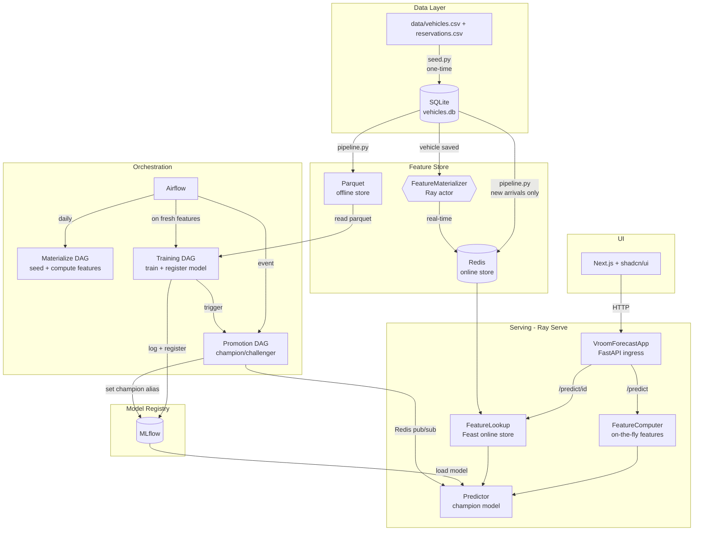
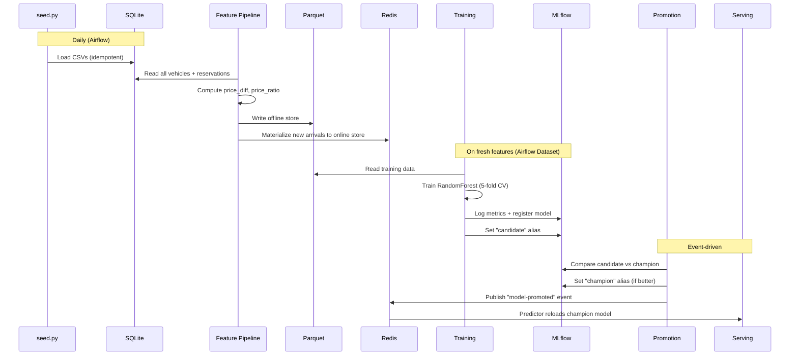

# Vroom Forecast

ML pipeline that predicts the number of reservations a vehicle will receive
based on its listing attributes. Built as a take-home project for a
**Staff MLOps Engineer** position at Turo.

## Architecture



## Quick Start

```bash
# 1. Start infrastructure (MLflow, Redis, Airflow, Serving)
docker compose up -d

# 2. Start the UI
cd ui && npm install && npm run dev

# 3. Seed the database and materialize features
docker compose exec airflow airflow dags trigger vroom_forecast_materialize

# 4. Train a model (auto-triggers after materialize via Airflow Dataset)
#    Or trigger manually:
docker compose exec airflow airflow dags trigger vroom_forecast_training

# 5. Open the UI
open http://localhost:3000
```

> **Airflow UI:** http://localhost:8080 — credentials: `admin` / `admin`

## Services

| Service | Port | Description |
|---------|------|-------------|
| MLflow | [localhost:5001](http://localhost:5001) | Experiment tracking + model registry |
| Redis | localhost:6379 | Online feature store + pub/sub |
| Redis Insight | [localhost:5540](http://localhost:5540) | Redis GUI |
| Airflow | [localhost:8080](http://localhost:8080) | Pipeline orchestration |
| Serving API | [localhost:8000](http://localhost:8000) | Prediction API (Ray Serve) |
| API Docs | [localhost:8000/docs](http://localhost:8000/docs) | Interactive Swagger UI |
| Ray Dashboard | [localhost:8265](http://localhost:8265) | Ray cluster monitoring |
| UI | [localhost:3000](http://localhost:3000) | Next.js frontend |
| Docs | [localhost:8100](http://localhost:8100) | MkDocs documentation |
| Jupyter | localhost:8888 | EDA notebooks |

## Project Structure

```
training/          ML training pipeline (pandas, sklearn, mlflow)
promotion/         Champion/challenger model promotion (mlflow, redis)
serving/           Ray Serve prediction API (ray, fastapi, feast)
features/          Feast feature store + materialization pipeline
exploration/       EDA notebook (jupytext)
ui/                Next.js + shadcn/ui frontend
airflow/           Airflow DAGs + Dockerfile
data/              Raw CSV datasets (vehicles + reservations)
```

Each sub-project is fully independent with its own `pyproject.toml`, `uv.lock`,
and `.venv`. See each sub-project's README for details.

## ML Pipeline



## Dev Tools

```bash
# Setup (one-time)
uvx pre-commit install

# Run all checks
uvx pre-commit run --all-files
```

| Tool | Scope | Purpose |
|------|-------|---------|
| Ruff | Python | Formatting + linting |
| ty | Python (per sub-project) | Type checking |
| ESLint | TypeScript | Linting |
| tsc | TypeScript | Type checking |
| pytest | Python (per sub-project) | Tests |

## Tech Stack

| Technology | Role |
|------------|------|
| Python 3.12 | Primary language |
| Ray Serve | Model serving (autoscaling, deployment composition) |
| FastAPI | HTTP API (Ray Serve ingress) |
| MLflow | Experiment tracking, model registry |
| Feast | Feature store (offline: Parquet, online: Redis) |
| Airflow | Pipeline orchestration |
| Redis | Online feature store + pub/sub events |
| Docker Compose | Local infrastructure |
| Next.js | Frontend (React, TypeScript, Tailwind) |
| shadcn/ui | UI component library |
| uv | Python package management |
| Ruff + ty | Linting + type checking |

## Key Findings — What Drives Reservations?

**Dataset:** 1,000 vehicles, 6,376 reservations. 9% of vehicles have zero reservations.
Average reservations per vehicle: 6.4 (median 5, std 4.9).

### Top Factors (RandomForest feature importance)

| Rank | Feature | Importance | Correlation | Interpretation |
|------|---------|------------|-------------|----------------|
| 1 | **price_diff** | 26.2% | -0.367 | The gap between actual and recommended price is the strongest predictor. Vehicles priced **below** the recommended price get significantly more reservations. |
| 2 | **price_ratio** | 20.7% | -0.398 | Confirms the pricing story. A ratio below 1.0 (underpriced) drives bookings. The strongest linear correlation of any feature. |
| 3 | **description** | 16.9% | +0.016 | Description length matters to the model but has near-zero linear correlation — the relationship is non-linear. Very short and very long descriptions both underperform. |
| 4 | **actual_price** | 11.9% | -0.259 | Lower absolute price drives more reservations, independent of the recommended price. |
| 5 | **num_images** | 10.5% | +0.220 | More photos → more reservations. The second strongest linear correlation. |
| 6 | **recommended_price** | 10.1% | -0.013 | Market price alone doesn't predict reservations, but it matters in combination with actual price (via the derived features). |
| 7 | **street_parked** | 2.1% | -0.017 | Minimal impact. Convenience of parking is not a major factor. |
| 8 | **technology** | 1.5% | +0.136 | Having a tech package helps slightly, but it's the weakest predictor. |

### Key Insights

1. **Pricing relative to market is everything.** The two derived features (`price_diff`, `price_ratio`) together account for 47% of the model's predictive power. Hosts who price below the recommended price see dramatically more bookings.

2. **Listing quality matters.** Description length (17%) and number of photos (10.5%) together account for 27%. This is actionable — Turo could nudge hosts to write longer descriptions and upload more photos.

3. **Absolute price is secondary to relative price.** `actual_price` alone is 12%, but the ratio/diff with `recommended_price` is 47%. A $100/day car priced at its recommended price gets more bookings than a $50/day car priced above its recommendation.

4. **Parking and technology are noise.** Together they account for only 3.6% of importance. These are "nice to have" but don't drive booking decisions.

### Model Performance

| Metric | Value |
|--------|-------|
| CV MAE (5-fold) | 3.45 (+/- 0.13) |
| Model | RandomForestRegressor (200 trees, max_depth=10) |

The model predicts reservation counts with an average error of ~3.5 reservations.
This is reasonable given the target distribution (mean 6.4, std 4.9).

## Latency Benchmark Report

Benchmarked over 1,000 iterations on the containerized Ray Serve deployment
(Docker, Apple M-series, single replica).

### Raw Features Path (`POST /predict`)

Features computed on the fly from request attributes → model inference.

| Metric | Value |
|--------|-------|
| **Average** | 18.94 ms |
| **p50 (median)** | 18.04 ms |
| **p95** | 29.07 ms |
| **p99** | 31.63 ms |

Step breakdown:
- Feature computation (FeatureComputer deployment): **2.65 ms** avg
- Model inference (Predictor deployment): **16.29 ms** avg

### Online Store Path (`POST /predict/id`)

Pre-computed features looked up from Redis → model inference.

| Metric | Value |
|--------|-------|
| **Average** | 18.13 ms |
| **p50 (median)** | 17.83 ms |
| **p95** | 18.83 ms |
| **p99** | 29.33 ms |

Step breakdown:
- Feature lookup from Redis (FeatureLookup deployment): **2.57 ms** avg
- Model inference (Predictor deployment): **15.56 ms** avg

### Analysis

Both paths have similar total latency (~18ms) because:

1. **Model inference dominates** at ~16ms — a RandomForest with 200 trees
   traverses all trees on every prediction.
2. **Feature computation is trivial** (~2.6ms) — two arithmetic operations
   (price_diff, price_ratio) take the same time as a Redis network round-trip.
3. **Ray Serve inter-deployment communication** adds ~2-3ms per hop
   (serialization through Ray's object store).

The online store path shows **tighter p95/p99 latency** (18.8ms vs 29.1ms),
meaning more consistent response times — fewer outlier predictions.

### What Would Change at Scale

| Optimization | Impact |
|--------------|--------|
| ONNX export of the RandomForest | 5-10x faster inference (eliminate Python overhead) |
| Batch requests to the Predictor | Amortize Ray serialization across N predictions |
| Multiple Predictor replicas | Linear throughput scaling |
| GPU-based model (XGBoost, neural net) | Leverage Ray Serve's GPU-aware scheduling |
| More complex features (aggregations, embeddings) | Online store path becomes significantly faster than on-the-fly |
