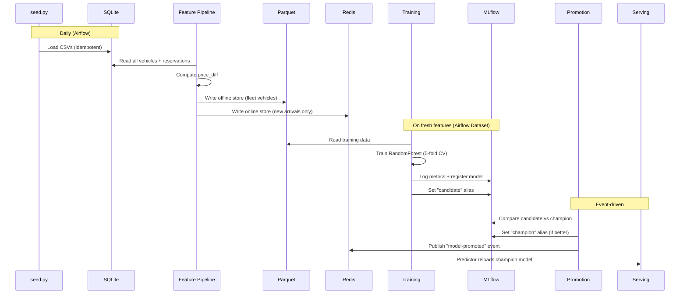

<div align="center">


[](https://github.com/pierreWagou/vroom-forecast/actions/workflows/ci.yml)
[](https://github.com/pierreWagou/vroom-forecast/actions/workflows/cd-docs.yml)
[](LICENSE)


</div>

---

ML pipeline that predicts the number of reservations a vehicle will receive based on its listing attributes. Built as a take-home project for a **Staff MLOps Engineer** position at [Turo](https://turo.com).

- **End-to-end MLOps** -- from feature engineering to model serving, orchestrated by Airflow
- **Champion/challenger promotion** -- models must beat the current champion before going live
- **Event-driven reload** -- Redis pub/sub triggers zero-downtime model swaps in Ray Serve
- **Dual feature store** -- Parquet for batch training, Redis for real-time point lookups (Feast)
- **Full observability** -- MLflow tracking, Ray Dashboard, interactive docs, and a Next.js frontend

> **[Live documentation](https://pierrewagou.github.io/vroom-forecast/)** &middot; **[Interactive API docs](http://localhost:8000/docs)** (local)

## Architecture

```
 ┌────────────────────────────────────────────────────────────────────────┐
 │                         Next.js + shadcn/ui                           │  frontend
 ├────────────────────────────────────────────────────────────────────────┤
 │                     Ray Serve (FastAPI ingress)                       │  serving
 ├──────────┬──────────┬──────────────┬──────────┬───────────────────────┤
 │Predictor │ Feature  │    Feature   │ Offline  │  Model Reload +       │
 │(sklearn) │ Computer │    Lookup    │ Reader   │  Feature Materializer │  deployments
 ├──────────┴──────────┼──────────────┴──────────┼───────────────────────┤
 │      MLflow         │        Feast            │       Redis           │  storage
 │  (registry + track) │  (offline + online)     │  (online + pub/sub)   │
 ├─────────────────────┴─────────────────────────┴───────────────────────┤
 │                   Airflow (BashOperator + uv)                         │  orchestration
 ├──────────────────┬───────────────────┬────────────────────────────────┤
 │    features/     │     training/     │          promotion/            │  pipelines
 │  (Feast, pandas) │ (sklearn, MLflow) │       (MLflow, Redis)          │
 └──────────────────┴───────────────────┴────────────────────────────────┘
```

## Structure

```
training/          ML training pipeline (pandas, sklearn, mlflow)
promotion/         Champion/challenger promotion (mlflow, redis)
serving/           Ray Serve prediction API (ray, fastapi, feast)
features/          Feast feature store + materialization pipeline
exploration/       EDA notebook (jupytext)
ui/                Next.js + shadcn/ui frontend
airflow/           Airflow DAGs + Dockerfile
data/              Raw CSV datasets (vehicles + reservations)
docs/              MkDocs Material documentation site
bruno/             Bruno API collection (pre-filled requests)
assets/            SVG banner
```

Each sub-project is fully independent with its own `pyproject.toml`, `uv.lock`, and `.venv`. No root virtualenv -- dev tools run via `uvx`.

<details>
<summary>Full directory tree</summary>

```
vroom-forecast/
├── training/
│   ├── train.py               # Pipeline: load, train RF, evaluate CV, register
│   ├── __main__.py            # CLI entry point
│   ├── pyproject.toml
│   └── tests/
├── promotion/
│   ├── promote.py             # Compare candidate vs champion, promote, notify
│   ├── __main__.py
│   ├── pyproject.toml
│   └── tests/
├── serving/
│   ├── app.py                 # FastAPI ingress (20+ endpoints)
│   ├── model.py               # Ray Serve deployments + background actors
│   ├── features.py            # Feature engineering
│   ├── vehicles.py            # SQLite persistence + Redis events
│   ├── schemas.py             # Pydantic request/response models
│   ├── config.py              # Pydantic Settings (SERVING_ prefix)
│   ├── __main__.py
│   ├── Dockerfile
│   ├── pyproject.toml
│   └── tests/
├── features/
│   ├── seed.py                # CSV -> SQLite seeder (idempotent)
│   ├── pipeline.py            # Compute features, write Parquet + Redis
│   ├── feature_repo/
│   │   ├── definitions.py     # Entity, FeatureView, feature refs
│   │   └── feature_store.yaml
│   ├── pyproject.toml
│   └── tests/
├── exploration/
│   ├── exploration.py         # Jupytext percent-format notebook
│   └── exploration.ipynb
├── ui/
│   ├── src/
│   │   ├── app/               # Next.js pages + layout
│   │   ├── components/        # shadcn/ui + custom components
│   │   └── lib/               # Typed API client (18+ functions)
│   └── package.json
├── airflow/
│   ├── Dockerfile
│   └── dags/                  # 4 DAGs (materialize, train, promote, pipeline)
├── docs/                      # MkDocs Material source
├── bruno/                     # Bruno API collection
├── data/                      # vehicles.csv, reservations.csv
├── docker-compose.yml         # MLflow, Redis, Airflow, Ray Serve
├── mise.toml                  # Tool versions + task runner
├── mprocs.yaml                # 7 concurrent dev services
├── mkdocs.yml
├── ruff.toml
└── .pre-commit-config.yaml
```

</details>

## Getting Started

### Prerequisites

| Tool | Purpose |
|------|---------|
| [mise](https://mise.jdx.dev/getting-started.html) | Installs and manages all dev tools automatically |
| [Docker Desktop](https://docs.docker.com/get-docker/) | Runs MLflow, Redis, Airflow, and Ray Serve |

### Setup

```bash
git clone https://github.com/pierreWagou/vroom-forecast.git
cd vroom-forecast

# Install tools (Python 3.12, Node LTS, uv, mprocs)
mise install

# Bootstrap all dependencies
mise run setup

# Start everything
mise run dev
```

The UI is at [localhost:3000](http://localhost:3000). Trigger the ML pipeline from Airflow at [localhost:8080](http://localhost:8080) (credentials: `admin` / `admin`).

### Quick Test

Once services are running and the pipeline has completed:

```bash
curl -s -X POST http://localhost:8000/predict \
  -H "Content-Type: application/json" \
  -d '{"technology":1,"actual_price":45,"recommended_price":50,"num_images":8,"street_parked":0,"description":250}'
```

```json
{"predicted_reservations": 4.12, "model_version": "1"}
```

Interactive docs at [localhost:8000/docs](http://localhost:8000/docs). A [Bruno](https://www.usebruno.com/) collection is included in `bruno/` with pre-filled payloads for every endpoint.

## Development

### Services

| Service | Port | Description |
|---------|------|-------------|
| **UI** | [3000](http://localhost:3000) | Next.js frontend |
| **Ray Serve API** | [8000](http://localhost:8000) | Prediction API |
| **API Docs** | [8000/docs](http://localhost:8000/docs) | Interactive Swagger UI |
| **Airflow** | [8080](http://localhost:8080) | Pipeline orchestration |
| **MLflow** | [5001](http://localhost:5001) | Experiment tracking + model registry |
| **Redis** | 6379 | Online feature store + pub/sub |
| **Redis Insight** | [5540](http://localhost:5540) | Redis GUI |
| **Ray Dashboard** | [8265](http://localhost:8265) | Ray cluster monitoring |
| **Docs** | [8100](http://localhost:8100) | MkDocs documentation |
| **Jupyter** | 8888 | EDA notebooks |

### CI

All checks run on push to `main` and on pull requests:

| Job | What it checks |
|-----|----------------|
| **ruff** | Python formatting + linting |
| **ty** | Type checking (training, promotion, serving, features) |
| **pytest** | Tests (training, promotion, serving, features) |
| **ui** | ESLint + tsc + Next.js build |
| **docker** | Dockerfile builds (serving, airflow) |
| **docs** | MkDocs strict build |

### Pre-commit hooks

| Hook | Scope |
|------|-------|
| ruff-format + ruff-check | Python |
| ty | Python (per sub-project) |
| eslint + tsc | TypeScript |
| pytest | Python (per sub-project) |

## ML Pipeline



## Key Findings

**Dataset:** 1,000 vehicles, 6,376 reservations. Average per vehicle: 6.4 (median 5, std 4.9).

### Production Model (5 features)

Based on the [exploration notebook](exploration/), the production model uses `technology`, `num_images`, `street_parked`, `description`, and `price_diff`.

| Metric | Value |
|--------|-------|
| CV MAE (5-fold) | **3.44** (+/- 0.50) |
| Model | RandomForestRegressor (100 trees) |

<details>
<summary>Exploratory analysis (8 features)</summary>

| Rank | Feature | Importance | Correlation | Interpretation |
|------|---------|------------|-------------|----------------|
| 1 | **price_diff** | 26.2% | -0.367 | Gap between actual and recommended price. Below-market pricing drives bookings. |
| 2 | **price_ratio** | 20.7% | -0.398 | Confirms the pricing story. Ratio below 1.0 drives bookings. |
| 3 | **description** | 16.9% | +0.016 | Non-linear -- very short and very long descriptions both underperform. |
| 4 | **actual_price** | 11.9% | -0.259 | Lower absolute price drives reservations. |
| 5 | **num_images** | 10.5% | +0.220 | More photos, more reservations. |
| 6 | **recommended_price** | 10.1% | -0.013 | Matters only in combination with actual price. |
| 7 | **street_parked** | 2.1% | -0.017 | Minimal impact. |
| 8 | **technology** | 1.5% | +0.136 | Slight positive effect. |

Three features were dropped for production: `actual_price` and `recommended_price` (collinear with `price_diff`), `price_ratio` (91% correlated with `price_diff`).

</details>

### Insights

1. **Pricing relative to market is everything.** `price_diff` alone accounts for ~33% of the production model's predictive power. Hosts who price below the recommended price see dramatically more bookings.
2. **Listing quality matters.** Description length (~38%) and number of photos (~16%) together account for over half of the importance.
3. **Parking and technology are noise.** Together ~13% of importance. Not decision drivers.

## Latency Benchmark

Benchmarked over 1,000 iterations on the containerized Ray Serve deployment (Docker, Apple M-series, single replica).

| Path | Avg | p50 | p95 | p99 |
|------|-----|-----|-----|-----|
| **Raw features** (`POST /predict`) | 13.87 ms | 13.24 ms | 14.38 ms | 25.23 ms |
| **Online store** (`POST /predict/id`) | 13.86 ms | 13.22 ms | 14.62 ms | 24.93 ms |

Both paths have similar latency because model inference dominates (~13.7 ms for 100 trees). Feature computation (~0.2 ms) and Redis lookup (~0.17 ms) are negligible.

<details>
<summary>What would change at scale</summary>

| Optimization | Impact |
|--------------|--------|
| ONNX export of the RandomForest | 5-10x faster inference |
| Batch requests to the Predictor | Amortize Ray serialization |
| Multiple Predictor replicas | Linear throughput scaling |
| GPU-based model (XGBoost, neural net) | Leverage Ray Serve GPU scheduling |
| More complex features | Online store path becomes significantly faster than on-the-fly |

</details>

## Design Decisions

<details>
<summary>RandomForest over XGBoost/LightGBM</summary>

The dataset is small (~500 vehicles) and the feature set simple. RF achieves CV MAE 3.44 with zero tuning; gradient boosting adds complexity and overfitting risk for marginal gain. Easy to swap later -- the pipeline is model-agnostic.

</details>

<details>
<summary>Ray Serve over plain FastAPI/Gunicorn</summary>

Turo lists Ray as a high-priority technology. Ray Serve's deployment composition lets us scale the Predictor, FeatureLookup, and FeatureMaterializer independently. For a single-model demo this is over-engineered -- but it demonstrates the pattern Turo would use at scale.

</details>

<details>
<summary>Feast over a raw Redis client</summary>

Feast gives us a unified offline/online store abstraction with point-in-time correctness for training. A raw Redis client would be simpler for serving alone, but wouldn't solve the training-serving skew problem. The tradeoff is operational complexity vs. feature consistency guarantees.

</details>

<details>
<summary>5 features, not 8</summary>

`price_diff` alone captures the pricing signal better than separate `actual_price` + `recommended_price` (collinear). `price_ratio` is 91% correlated with `price_diff` -- adding it doesn't improve the model but does add a feature to maintain.

</details>

<details>
<summary>Parquet offline + Redis online</summary>

Training needs all historical vehicles (batch access). Serving needs individual vehicle lookup (point access). Parquet is fast for batch reads; Redis is fast for point lookups. A single store can't serve both patterns well.

</details>

<details>
<summary>Separate sub-projects with independent venvs</summary>

Each pipeline stage has its own `pyproject.toml` and `.venv`. Airflow shouldn't need scikit-learn, and the serving container shouldn't ship pandas. The tradeoff is duplicated `FEATURE_COLS` definitions -- acceptable for isolation.

</details>

<details>
<summary>Champion/challenger promotion over auto-deploy</summary>

Every model version gets the `candidate` alias first and must beat the current `champion` on CV MAE before being promoted. This prevents regressions from reaching production.

</details>

<details>
<summary>Redis pub/sub for model reload</summary>

When a new champion is promoted, Redis pub/sub gives instant notification with zero-downtime reload. The serving layer already depends on Redis (Feast online store), so this adds no new infrastructure.

</details>

## Production Considerations

This is a demo -- here's what would change for production:

| Area | What's missing |
|------|---------------|
| **Security** | CORS is `allow_origins=["*"]`, Airflow uses `admin`/`admin`. Needs restricted origins, secrets manager, auth middleware. |
| **Data quality** | Pydantic validates schemas, but no drift monitoring. Add Evidently or Great Expectations. |
| **Retraining** | Manual trigger only. Add triggers on drift detection, performance degradation, or new data volume. |
| **Observability** | Dev has Ray Dashboard + MLflow UI. Production needs structured logging, Prometheus metrics, alerting. |

## Tech Stack

| Technology | Role |
|------------|------|
| Python 3.12 | Primary language |
| Ray Serve | Model serving (autoscaling, deployment composition) |
| FastAPI | HTTP API (Ray Serve ingress) |
| MLflow | Experiment tracking, model registry |
| Feast | Feature store (offline: Parquet, online: Redis) |
| Airflow | Pipeline orchestration |
| Redis | Online feature store + pub/sub events |
| Docker Compose | Local infrastructure |
| Next.js | Frontend (React, TypeScript, Tailwind) |
| shadcn/ui | UI component library |
| uv | Python package management |
| Ruff + ty | Linting + type checking |

## Agent-Enabled Repository

This repo ships with built-in AI agent support. The following files give any compatible coding agent full project context out of the box:

| File | Purpose |
|------|---------|
| `AGENTS.md` | Always-on context -- Turo role, tech stack, design principles, task spec |
| `.opencode/skills/` | On-demand skills loaded when a task matches their domain |

<details>
<summary>Available skills</summary>

| Skill | Description |
|-------|-------------|
| **training** | ML training pipeline -- scikit-learn, MLflow tracking, offline store |
| **promotion** | Champion/challenger promotion -- MLflow aliases, Redis pub/sub |
| **serving** | Ray Serve prediction API -- FastAPI, Feast, deployment composition |
| **features** | Feast feature store -- offline/online stores, materialization pipeline |
| **airflow** | Pipeline orchestration -- DAG definitions, BashOperator + uv isolation |
| **ui** | Next.js + shadcn/ui frontend -- Turo design, SSE streams |
| **exploration** | EDA notebook -- Jupytext, data analysis |
| **local-dev** | Local development -- Docker services, mprocs, pipeline triggers, ports |
| **docs** | MkDocs Material documentation site -- structure, conventions |

</details>

## Quick Reference

| Action | Command |
|--------|---------|
| Bootstrap | `mise install && mise run setup` |
| Start all services | `mise run dev` |
| Full CI check | `mise run check` |
| Run ML pipeline | `mise run pipeline` |
| Train model | `mise run train` |
| Promote model | `mise run promote` |
| Seed + materialize | `mise run seed` |

## License

[MIT](LICENSE)
