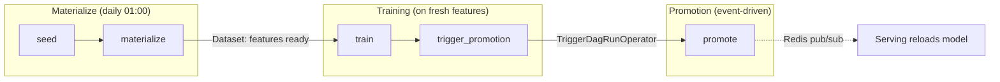
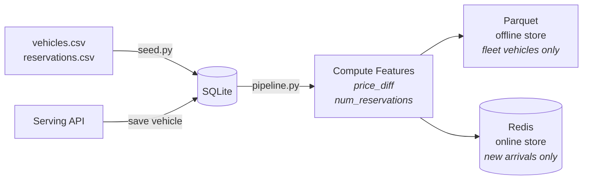

# Airflow

Orchestration layer for ML pipelines. Contains the Dockerfile and DAG
definitions. No ML dependencies — pipelines run via `BashOperator` + `uv run`.

## DAG Flow



## DAGs

| DAG | Schedule | Tasks | Description |
|-----|----------|-------|-------------|
| `vroom_forecast_materialize` | `0 1 * * *` (daily) | seed, materialize | Seed DB from CSVs, compute features, write Parquet + Redis (new arrivals) |
| `vroom_forecast_training` | Dataset-driven (after materialize) | train, trigger_promotion | Train from offline store, register candidate, trigger promotion |
| `vroom_forecast_promotion` | None (event-driven) | promote | Compare candidate vs champion, promote if better, notify via Redis |

## Materialization Pipeline

The materialize DAG runs two steps that populate the feature stores:



### Step 1: Seed (`seed.py`)

Loads `vehicles.csv` and `reservations.csv` into SQLite. Idempotent — safe to
run multiple times. Vehicles are inserted with `source='csv'`.

```bash
cd features && uv run python seed.py --data-dir ../data --db /feast-data/vehicles.db
```

### Step 2: Materialize (`pipeline.py`)

Reads all vehicles + reservations from SQLite, computes derived features, and
writes to both stores:

1. **Fleet vehicles** (observed `num_reservations`) → Parquet (offline store) — used for training and fleet display
2. **New arrivals only** (`num_reservations IS NULL`) → Redis via `store.write_to_online_store()` — used for real-time inference

```bash
cd features && uv run python pipeline.py \
    --db /feast-data/vehicles.db \
    --feast-repo feature_repo \
    --parquet-path /feast-data/vehicle_features.parquet
```

### Derived features computed

| Feature | Formula |
|---------|---------|
| `price_diff` | `actual_price - recommended_price` |
| `num_reservations` | `COUNT(reservations)` per vehicle — `NULL` for ui-sourced vehicles, `0` for csv vehicles with no bookings |

### Running

```bash
# Via Airflow (recommended — handles seed + materialize in order):
docker compose exec airflow airflow dags trigger vroom_forecast_materialize

# Or manually:
cd features && uv run python seed.py --data-dir ../data --db /feast-data/vehicles.db
cd features && uv run python pipeline.py --db /feast-data/vehicles.db \
    --feast-repo feature_repo --parquet-path /feast-data/vehicle_features.parquet
```

## How it works

Airflow doesn't install any ML dependencies. Each task runs:

```bash
uv run --project <project> python -m <module> [args]
# or
cd features && uv run python pipeline.py [args]
```

uv creates an isolated venv inside the container on first run.

## Key files

- `Dockerfile` — Extends `apache/airflow:2.10.5-python3.12`, adds `uv`, copies sub-projects
- `dags/vroom_forecast_materialize.py` — Feature materialization DAG
- `dags/vroom_forecast_training.py` — Training DAG
- `dags/vroom_forecast_promotion.py` — Promotion DAG

## Credentials

The admin user is created explicitly in `docker-compose.yml` with credentials
`admin` / `admin`. The password is also written to:

```bash
docker compose exec airflow cat /opt/airflow/standalone_admin_password.txt
```
