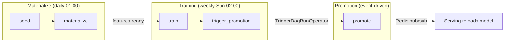

# Airflow

Orchestration layer for ML pipelines. Contains the Dockerfile and DAG
definitions. No ML dependencies — pipelines run via `BashOperator` + `uv run`.

## DAG Flow



## DAGs

| DAG | Schedule | Tasks | Description |
|-----|----------|-------|-------------|
| `vroom_forecast_materialize` | `0 1 * * *` (daily) | seed, materialize | Seed DB from CSVs, compute features, write Parquet + Redis |
| `vroom_forecast_training` | `0 2 * * 0` (Sundays) | train, trigger_promotion | Train from offline store, register candidate, trigger promotion |
| `vroom_forecast_promotion` | None (event-driven) | promote | Compare candidate vs champion, promote if better, notify via Redis |

## How it works

Airflow doesn't install any ML dependencies. Each task runs:

```bash
uv run --project <project> python -m <module> [args]
# or
cd features && uv run python pipeline.py [args]
```

uv creates an isolated venv inside the container on first run.

## Key files

- `Dockerfile` — Extends `apache/airflow:2.10.5-python3.12`, adds `uv`, copies sub-projects
- `dags/vroom_forecast_materialize.py` — Feature materialization DAG
- `dags/vroom_forecast_training.py` — Training DAG
- `dags/vroom_forecast_promotion.py` — Promotion DAG

## Credentials

`airflow standalone` generates an admin password on first start:

```bash
docker compose exec airflow cat /opt/airflow/standalone_admin_password.txt
```
