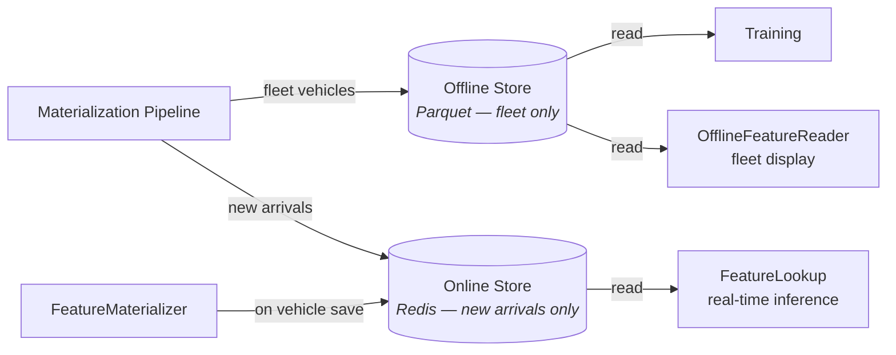
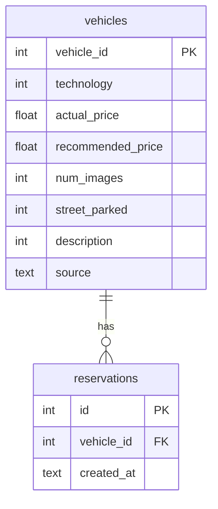

# Feature Store

Feast-based feature store with offline (Parquet) and online (Redis) stores.
Single source of truth for all vehicle features used in training and serving.

## Stores



**Offline store** (Parquet) — contains fleet vehicles only (those with an observed
`num_reservations`, including 0). Populated by the
[materialization pipeline](airflow/#materialization-pipeline) (daily via
Airflow). Read by the training pipeline (as training data) and by the serving
layer's `OfflineFeatureReader` for fleet vehicle display.

**Online store** (Redis) — contains only new arrivals (vehicles with no observed
reservations). Populated two ways:
- **Real-time:** [`FeatureMaterializer`](serving/#architecture) Ray actor
  computes features and writes to Redis on vehicle save (via Redis pub/sub)
- **Batch backfill:** [materialization pipeline](airflow/#materialization-pipeline)
  writes new arrivals via `store.write_to_online_store()` on each daily run

Read by `FeatureLookup` for real-time inference on new arrivals.

## Feature View

| Property | Value |
|----------|-------|
| Name | `vehicle_features` |
| Entity | `vehicle` (key: `vehicle_id`) |
| TTL | 365 days |
| Source | `FileSource` (Parquet) |

## Feature Schema

5 model features — raw prices are vehicle attributes used to compute `price_diff`
but are not model inputs (they are collinear with the derived feature).

| Feature | Type | Source | Description |
|---------|------|--------|-------------|
| `technology` | Int64 | Raw | Instant-bookable tech package (0/1) |
| `num_images` | Int64 | Raw | Number of listing photos (1–5) |
| `street_parked` | Int64 | Raw | Street parked flag (0/1) |
| `description` | Int64 | Raw | Character count of listing description |
| `price_diff` | Float64 | Derived | `actual_price - recommended_price` |

Label (not a model input):

| Field | Type | Description |
|-------|------|-------------|
| `num_reservations` | Int64 (nullable) | Observed reservation count. `NULL` for new arrivals (no history yet), `0` or more for fleet vehicles. |

## Feast Configuration

```yaml
# feature_repo/feature_store.yaml
project: vroom_forecast
provider: local
registry: ${FEAST_REGISTRY}       # feast-data/registry.db
online_store:
  type: redis
  connection_string: ${FEAST_REDIS}  # localhost:6379
offline_store:
  type: file
```

## Key Files

- `feature_repo/feature_store.yaml` — Feast config (offline: file, online: Redis)
- `feature_repo/definitions.py` — Entity, FileSource, FeatureView, feature refs
- `seed.py` — Loads CSVs into SQLite (idempotent, used by the materialization pipeline)
- `pipeline.py` — Computes features and writes to stores (called by Airflow)

## Database Schema

The SQLite database is the mutable source of truth for vehicle data.
It is populated by `seed.py` (CSV vehicles) and the serving API (UI vehicles).


