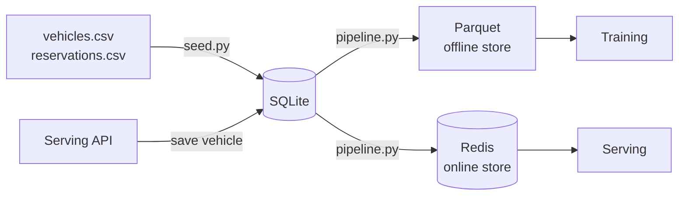
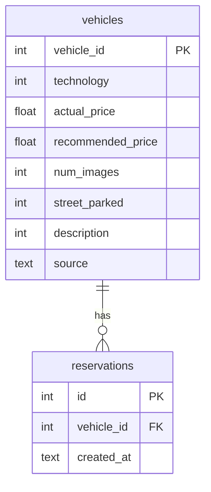

# Feature Store

Feast-based feature store with offline (Parquet) and online (Redis) stores.
Single source of truth for all vehicle features.

## Data Flow



## Running

```bash
# Seed the database (idempotent):
cd features && uv run python seed.py --data-dir ../data --db /feast-data/vehicles.db

# Run the feature pipeline:
cd features && uv run python pipeline.py --db /feast-data/vehicles.db

# Via Airflow (seed + materialize):
docker compose exec airflow airflow dags trigger vroom_forecast_materialize
```

## Key files

- `seed.py` — Loads CSVs into SQLite (idempotent, one-time)
- `pipeline.py` — Reads SQLite, computes features, writes Parquet + materializes to Redis
- `worker.py` — Real-time materialization worker (Redis pub/sub)
- `feature_repo/feature_store.yaml` — Feast config (file offline + Redis online)
- `feature_repo/definitions.py` — Entity, FeatureView, schema, feature refs

## Feature Schema

| Feature | Type | Source |
|---------|------|--------|
| technology | Int64 | Raw |
| actual_price | Float64 | Raw |
| recommended_price | Float64 | Raw |
| num_images | Int64 | Raw |
| street_parked | Int64 | Raw |
| description | Int64 | Raw |
| price_diff | Float64 | Derived (actual - recommended) |
| price_ratio | Float64 | Derived (actual / recommended) |
| num_reservations | Int64 | Aggregated (label, not a feature) |

## Database Schema


