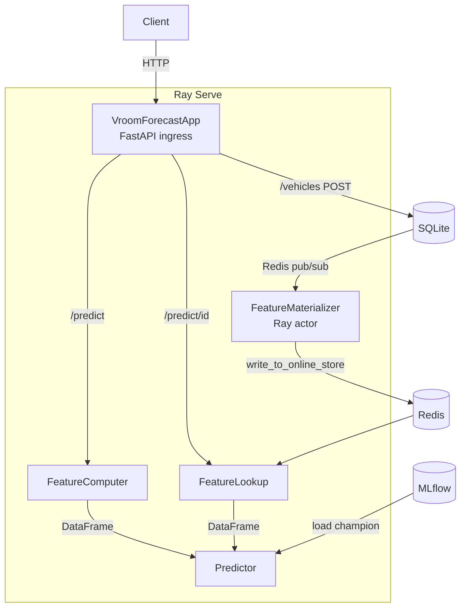

# Serving API

Ray Serve prediction service for vroom-forecast. FastAPI ingress with
Ray Serve deployments for model inference, feature computation, and
online store lookup.

## Architecture



## Running

```bash
# Local:
uv run --project serving python -m serving

# Docker:
docker compose up serving    # port 8000 + Ray dashboard on 8265
```

## Endpoints

| Method | Path | Description |
|--------|------|-------------|
| GET | `/health` | Liveness check + model info + Feast online status |
| POST | `/reload` | Hot-reload champion model from MLflow |
| POST | `/predict` | Single prediction from raw attributes (on-the-fly features) |
| POST | `/predict/id` | Prediction by vehicle ID (features from online store) |
| POST | `/predict/batch` | Batch prediction (up to 1000, on-the-fly features) |
| POST | `/benchmark` | Latency benchmark: on-the-fly features + inference |
| POST | `/benchmark/id` | Latency benchmark: online store lookup + inference |
| POST | `/vehicles` | Save a vehicle to SQLite (emits Redis event for materialization) |
| GET | `/vehicles` | List all vehicles |
| GET | `/vehicles/{id}/features` | Get computed features from online store |

Interactive docs at `http://localhost:8000/docs`.

## Configuration

| Variable | Default | Description |
|----------|---------|-------------|
| `SERVING_MLFLOW_URI` | `http://localhost:5001` | MLflow tracking server |
| `SERVING_MODEL_NAME` | `vroom-forecast` | Registered model name |
| `SERVING_HOST` | `0.0.0.0` | Bind address |
| `SERVING_PORT` | `8000` | Bind port |
| `SERVING_FEAST_REPO` | None | Path to Feast feature repo |
| `SERVING_REDIS_URL` | None | Redis URL for pub/sub + model reload |
